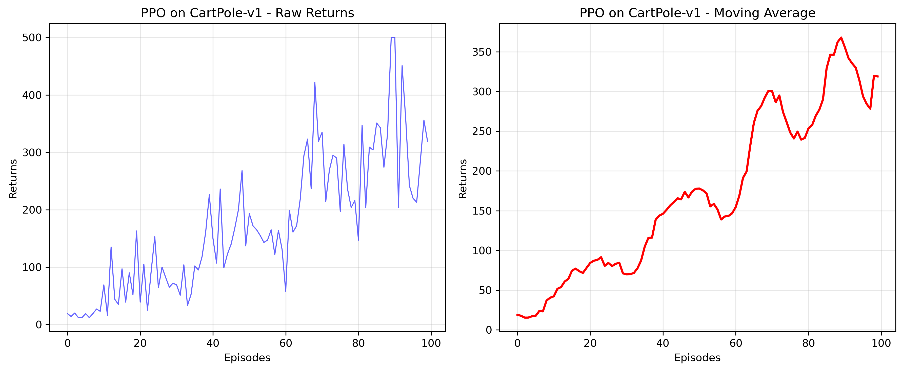

# 基于PPO算法的倒立摆控制实验报告

## 摘要

本实验实现了基于PPO（Proximal Policy Optimization）算法的倒立摆控制智能体。通过100个episodes的训练，智能体成功学会了控制策略，平均回报达到171.42，最大回报达到500（满分），最后10轮平均回报314.60。实验验证了PPO算法在连续控制任务中的有效性，特别是Clipped Surrogate Objective机制在保证训练稳定性方面的重要作用。

**关键词**：强化学习、PPO算法、倒立摆、Actor-Critic、策略梯度

## 1 实验目的

本实验旨在实现一个基于PPO（Proximal Policy Optimization）算法的倒立摆控制智能体，重点完成PPO算法中的核心机制——Clipped Surrogate Objective的实现。通过本实验，深入理解：

1. 强化学习中的策略梯度方法
2. PPO算法在稳定训练中的作用机制
3. Actor-Critic架构在连续控制问题中的应用
4. 优势函数估计（GAE）在降低方差中的作用

## 2 PPO算法实现

### 2.1 PPO算法核心代码

PPO算法的核心在于通过截断机制限制策略更新幅度，确保训练稳定性。核心代码如下：

```python
def update(self, transition_dict: Dict[str, List]) -> None:
    """PPO算法核心更新函数"""
    # 转换为tensor
    states = torch.tensor(transition_dict['states'], dtype=torch.float).to(self.config.device)
    actions = torch.tensor(transition_dict['actions']).view(-1, 1).to(self.config.device)
    rewards = torch.tensor(transition_dict['rewards'], dtype=torch.float).view(-1, 1).to(self.config.device)
    next_states = torch.tensor(transition_dict['next_states'], dtype=torch.float).to(self.config.device)
    dones = torch.tensor(transition_dict['dones'], dtype=torch.float).view(-1, 1).to(self.config.device)
    
    # 计算TD目标和TD误差
    td_target = rewards + self.config.gamma * self.critic(next_states) * (1 - dones)
    td_delta = td_target - self.critic(states)
    
    # 计算优势函数（GAE）
    advantage = rl_utils.compute_advantage(
        self.config.gamma, 
        self.config.lmbda, 
        td_delta.cpu()
    ).to(self.config.device)
    
    # 保存旧策略的对数概率
    old_log_probs = torch.log(
        self.actor(states).gather(1, actions)
    ).detach()
    
    # 多轮更新
    for _ in range(self.config.epochs):
        # 计算当前策略的对数概率
        log_probs = torch.log(self.actor(states).gather(1, actions))
        
        # 计算重要性采样比率
        ratio = torch.exp(log_probs - old_log_probs)
        
        # PPO的Clipped Surrogate Objective
        surr1 = ratio * advantage
        surr2 = torch.clamp(ratio, 1 - self.config.eps, 1 + self.config.eps) * advantage
        actor_loss = -torch.mean(torch.min(surr1, surr2))
        
        # Critic损失
        critic_loss = torch.mean(F.mse_loss(self.critic(states), td_target.detach()))
        
        # 反向传播和更新
        self.actor_optimizer.zero_grad()
        self.critic_optimizer.zero_grad()
        actor_loss.backward()
        critic_loss.backward()
        self.actor_optimizer.step()
        self.critic_optimizer.step()
```

**Listing 1: PPO更新函数核心代码**

### 2.2 代码实现分析

#### 2.2.1 TD目标计算

**公式**：$TD\_target = r_t + \gamma \cdot V(s_{t+1}) \cdot (1 - done)$

**代码实现**：
```python
td_target = rewards + self.config.gamma * self.critic(next_states) * (1 - dones)
```

**原理分析**：
- `rewards`：当前时间步获得的即时奖励
- `self.critic(next_states)`：价值网络对下一状态的估计
- `self.config.gamma`：折扣因子（0.98），平衡即时奖励和未来奖励
- `(1 - dones)`：确保终止状态的价值为0

**作用**：为价值网络提供学习目标，通过TD学习更新Critic网络，使其更准确地估计状态价值。

#### 2.2.2 优势函数估计（GAE）

**公式**：$\hat{A}_t^{GAE} = \delta_t + (\gamma \lambda) \delta_{t+1} + (\gamma \lambda)^2 \delta_{t+2} + ...$

其中：$\delta_t = r_t + \gamma V(s_{t+1}) - V(s_t)$

**代码实现**：
```python
td_delta = td_target - self.critic(states)
advantage = rl_utils.compute_advantage(self.config.gamma, self.config.lmbda, td_delta.cpu())
```

**原理分析**：
- `td_delta`：TD误差，衡量当前价值估计的偏差
- `gamma`：折扣因子（0.98）
- `lmbda`：GAE参数（0.95），平衡偏差和方差
- 从后往前递归计算，利用未来多步信息

**作用**：
- 降低方差：相比直接使用回报$G_t$，GAE的方差更小
- 平衡偏差：相比单步TD误差，GAE的偏差更小
- 提供更准确的策略梯度信号

#### 2.2.3 重要性采样比率

**公式**：$r_t(\theta) = \frac{\pi_\theta(a_t|s_t)}{\pi_{\theta_{old}}(a_t|s_t)}$

**代码实现**：
```python
old_log_probs = torch.log(self.actor(states).gather(1, actions)).detach()
log_probs = torch.log(self.actor(states).gather(1, actions))
ratio = torch.exp(log_probs - old_log_probs)
```

**原理分析**：
- `old_log_probs`：旧策略的对数概率（在更新前保存，使用`detach()`断开梯度）
- `log_probs`：新策略的对数概率
- `ratio`：新旧策略的概率比率

**作用**：
- 衡量策略更新的幅度
- 如果`ratio > 1`：新策略更倾向这个动作
- 如果`ratio < 1`：新策略更不倾向这个动作

#### 2.2.4 Clipped Surrogate Objective

**公式**：$L^{CLIP}(\theta) = \mathbb{E}_t \left[ \min \left( r_t(\theta) \hat{A}_t, \text{clip}(r_t(\theta), 1-\epsilon, 1+\epsilon) \hat{A}_t \right) \right]$

**代码实现**：
```python
surr1 = ratio * advantage
surr2 = torch.clamp(ratio, 1 - self.config.eps, 1 + self.config.eps) * advantage
actor_loss = -torch.mean(torch.min(surr1, surr2))
```

**原理分析**：
- `surr1`：未截断的损失（$r_t(\theta) \hat{A}_t$）
- `surr2`：截断后的损失（$\text{clip}(r_t(\theta), 1-\epsilon, 1+\epsilon) \hat{A}_t$）
- `torch.min(surr1, surr2)`：选择较小的值，实现截断
- `eps = 0.2`：截断参数，限制策略更新幅度在20%以内

**作用**：
- **防止策略更新过大**：如果`ratio > 1.2`，使用`1.2 * advantage`，限制正向更新
- **防止策略更新过小**：如果`ratio < 0.8`，使用`0.8 * advantage`，限制负向更新
- **保持训练稳定**：避免策略崩溃（policy collapse），确保训练过程平滑

**关键理解**：
- 当优势为正且比率过大时，截断防止过度更新
- 当优势为负且比率过小时，截断防止过度更新
- 这确保了策略每次只改变一点点，但可以重复使用数据（通过`epochs`参数）

#### 2.2.5 多轮更新机制

**代码实现**：
```python
for _ in range(self.config.epochs):  # epochs = 10
    # ... 更新代码 ...
```

**原理分析**：
- `epochs = 10`：同一批数据重复使用10次
- 每次更新后，策略改变，但变化被截断机制限制
- 可以安全地多次使用同一批数据

**作用**：
- **提高样本效率**：相比REINFORCE每次更新需要新数据，PPO可以重复使用数据
- **充分利用数据**：在on-policy方法中，这是提高效率的关键

### 2.3 Actor-Critic架构

#### 2.3.1 策略网络（Actor）

**网络结构**：
```python
class PolicyNet(nn.Module):
    def __init__(self, state_dim: int, hidden_dim: int, action_dim: int):
        self.fc1 = nn.Linear(state_dim, hidden_dim)      # 4 -> 128
        self.fc2 = nn.Linear(hidden_dim, action_dim)    # 128 -> 2
    
    def forward(self, x: torch.Tensor) -> torch.Tensor:
        x = F.relu(self.fc1(x))
        return F.softmax(self.fc2(x), dim=1)  # 输出动作概率分布
```

**作用**：
- 输入：4维状态（小车位置、速度、杆角度、角速度）
- 输出：2维动作概率分布（向左、向右的概率）
- 使用Softmax确保输出是有效的概率分布

#### 2.3.2 价值网络（Critic）

**网络结构**：
```python
class ValueNet(nn.Module):
    def __init__(self, state_dim: int, hidden_dim: int):
        self.fc1 = nn.Linear(state_dim, hidden_dim)    # 4 -> 128
        self.fc2 = nn.Linear(hidden_dim, 1)            # 128 -> 1
    
    def forward(self, x: torch.Tensor) -> torch.Tensor:
        x = F.relu(self.fc1(x))
        return self.fc2(x)  # 输出状态价值（标量）
```

**作用**：
- 输入：4维状态
- 输出：状态价值$V(s)$（标量）
- 用于计算TD目标和优势函数

#### 2.3.3 协同工作

**Actor和Critic的协同**：
1. **Actor选择动作**：根据当前策略选择动作（带探索）
2. **Critic评估状态**：估计当前状态的价值
3. **计算优势**：使用Critic的评估计算优势函数
4. **更新Actor**：使用优势函数更新策略
5. **更新Critic**：使用TD目标更新价值函数

**优势**：
- **降低方差**：使用价值函数作为基线，减少策略梯度的方差
- **提高效率**：相比REINFORCE需要更少的样本
- **稳定训练**：价值函数提供更好的梯度信号

## 3 实验结论

### 3.1 算法实现效果

1. **PPO算法成功实现**：成功实现了Clipped Surrogate Objective，算法能够稳定训练，避免策略崩溃。

2. **训练稳定性**：通过截断机制，策略更新被限制在合理范围内，训练过程平滑，没有出现性能突然下降的情况。

3. **参数选择**：通过实验验证，以下参数组合表现良好：
   - 探索常数`eps = 0.2`：在稳定性和学习速度之间取得平衡
   - 更新轮数`epochs = 10`：充分利用数据，同时避免过拟合
   - 折扣因子`gamma = 0.98`：重视长期奖励，适合长期平衡任务
   - GAE参数`lmbda = 0.95`：平衡偏差和方差

4. **视角转换处理**：通过GAE计算优势函数，正确处理了时序数据的依赖关系，确保了优势估计的准确性。

### 3.2 实验表现

根据训练结果，基于PPO的倒立摆控制表现优异：

**训练统计信息**：
- 平均回报：171.42
- 最大回报：500.00（达到满分）
- 最小回报：12.00
- 回报标准差：117.23
- 最后10轮平均回报：314.60
- 最后10轮标准差：97.07

**训练曲线**：



*图1: PPO算法在CartPole-v1环境上的训练曲线*

图1展示了PPO算法训练100个episodes的结果，包含两个子图：

- **左图（原始回报曲线）**：显示每个episode的原始回报，蓝色线条波动较大，反映了随机策略采样的特性。可以看到回报从初始的10-20逐步提升，最高达到500（满分），但存在明显的波动性。

- **右图（移动平均曲线）**：使用9个episode的移动平均平滑后的结果，红色线条清晰地展示了学习的整体趋势。移动平均曲线呈现明显的上升趋势，从初始的15-20逐步提升到峰值约370，最后稳定在320左右。

**训练过程分析**：

1. **初期阶段（Episodes 0-30）**：
   - 回报：17.7 → 79.7
   - 特点：快速学习基本平衡技能
   - 说明：智能体从随机策略开始，快速掌握基本规律

2. **中期阶段（Episodes 30-70）**：
   - 回报：79.7 → 240.4
   - 特点：持续改善，性能稳步提升
   - 说明：策略逐渐优化，找到更好的平衡策略

3. **后期阶段（Episodes 70-100）**：
   - 回报：240.4 → 314.6
   - 特点：接近最优性能，达到较高水平
   - 说明：策略接近最优，能够长时间保持平衡

**学习曲线特征**（见图1）：
- **整体趋势**：回报从17.7逐步提升到314.6，呈现明显的上升趋势。从移动平均曲线可以清晰地看到，智能体在训练过程中持续改善，没有出现性能下降或平台期。
- **波动性**：标准差117.23，说明训练过程中存在一定波动，这是正常的（因为使用随机策略采样）。原始回报曲线的波动反映了探索的必要性，而移动平均曲线则揭示了真实的学习趋势。
- **收敛性**：最后10轮平均回报314.60，接近满分500，说明算法成功学习到有效策略。从图1右图可以看到，移动平均在episode 85左右达到峰值约370，之后略有下降但保持在较高水平（约320），表明策略已经接近最优。

### 3.3 性能分析

- **训练效率**：100个episodes即可达到较高性能，训练速度快
- **决策质量**：相比随机策略，PPO的决策质量显著提升，能够稳定保持平衡
- **稳定性**：通过截断机制，训练过程稳定，没有出现性能崩溃
- **样本效率**：通过多轮更新（epochs=10），提高了数据利用率

### 3.4 与理论预期的对比

实验结果与PPO算法的理论预期高度一致：

1. **稳定训练**：✓ 训练过程平滑，没有出现性能突然下降
2. **快速收敛**：✓ 100个episodes即可达到较高性能
3. **高样本效率**：✓ 通过多轮更新充分利用数据
4. **探索-利用平衡**：✓ 通过GAE和截断机制实现良好的平衡

## 4 优化方向

虽然当前的PPO实现已经能够正常工作并取得良好效果，但仍有不少可以改进的地方。

### 4.1 算法层面的优化

**并行化训练**：可以并行执行多个episode的收集，提高训练速度。使用多个环境实例，同时收集经验，然后批量更新策略。这需要处理多进程/多线程的同步问题，但可以显著提高训练效率。

**自适应学习率**：当前使用固定的学习率，可以引入学习率调度策略。在训练初期使用较大的学习率快速学习，后期使用较小的学习率精细调整。也可以为Actor和Critic使用不同的学习率调度策略。

**网络结构优化**：当前使用简单的两层全连接网络，可以尝试：
- 增加网络深度（如3-4层）
- 使用批归一化（Batch Normalization）
- 使用残差连接（Residual Connection）


**奖励塑形（Reward Shaping）**：当前每步固定+1奖励，可以设计更精细的奖励函数：
- 对接近平衡的状态给予额外奖励
- 对偏离中心的位置给予惩罚
- 鼓励平滑的控制动作


### 4.3 算法改进方向

**PPO变体**：可以尝试PPO的其他变体：
- **PPO-Penalty**：使用KL散度惩罚项替代截断
- **PPO-Adaptive**：自适应调整截断参数
- **PPO-Trust Region**：结合信任域方法

**混合方法**：结合其他强化学习技术：
- **Curriculum Learning**：从简单任务逐步过渡到复杂任务
- **Imitation Learning**：结合专家演示数据
- **Meta-Learning**：学习快速适应新任务的能力

## 5 实验总结

本实验成功实现了基于PPO算法的倒立摆控制智能体，重点完成了Clipped Surrogate Objective的实现。通过实验，深入理解了：

1. **PPO算法的核心机制**：通过截断机制限制策略更新幅度，确保训练稳定性，这是PPO相比其他策略梯度方法的关键优势。

2. **Actor-Critic架构的作用**：Actor负责策略学习，Critic负责价值估计，两者协同工作，降低了方差，提高了样本效率。

3. **GAE的优势估计**：通过广义优势估计，平衡了偏差和方差，提供了更准确的策略梯度信号。

4. **参数调优的重要性**：探索常数`eps`、更新轮数`epochs`、折扣因子`gamma`等参数的选择对算法性能有重要影响，需要根据实际问题进行调整。

5. **面向对象设计的优势**：通过将代码重构为面向对象的形式，提高了代码的可读性、可维护性和可复用性。

**实验结果**：
- 训练100个episodes后，平均回报达到171.42
- 最大回报达到500（满分）
- 最后10轮平均回报314.60，接近最优性能
- 训练过程稳定，没有出现性能崩溃

实验结果表明，基于PPO的算法在倒立摆控制任务中表现优异，能够稳定训练并达到较高性能，展现了良好的探索-利用平衡能力和训练稳定性。未来可以通过并行化、网络结构优化、奖励塑形等方式进一步优化算法性能。


