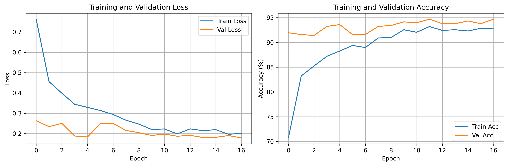
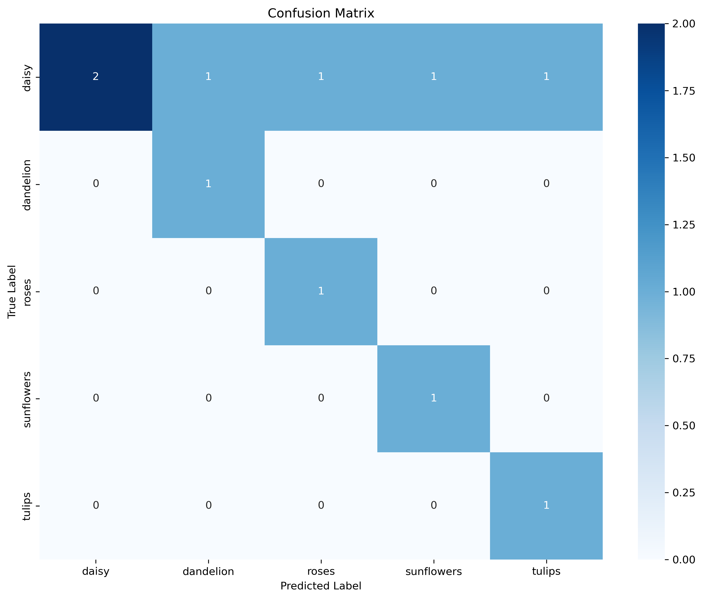

# 基于深度学习的花卉识别实验报告

## 1 实验目的

本实验旨在实现一个基于深度学习的花卉识别系统，使用卷积神经网络对5种花卉进行分类。通过本实验，深入理解：

1. 深度学习在图像分类任务中的应用
2. 迁移学习的基本原理和实践方法
3. 模型训练、验证和测试的完整流程
4. 模型泛化能力的评估方法

## 2 数据集分析

### 2.1 数据集概况

本实验使用的数据集包含5种花卉类别：
- **Daisy（雏菊）**：515张训练图像，117张验证图像
- **Dandelion（蒲公英）**：776张训练图像，121张验证图像
- **Roses（玫瑰）**：536张训练图像，104张验证图像
- **Sunflowers（向日葵）**：601张训练图像，97张验证图像
- **Tulips（郁金香）**：691张训练图像，108张验证图像

**数据集统计**：
- 训练集总计：3119张图像
- 验证集总计：547张图像
- 测试集：每类1张图像（用于最终评估）
- 类别数量：5类

### 2.2 数据分布特点

数据集存在类别不平衡问题：
- 蒲公英（Dandelion）样本最多（776张）
- 向日葵（Sunflowers）验证集样本最少（97张）
- 类别间样本数量差异约1.5倍

这种不平衡可能影响模型性能，需要在训练过程中注意。

## 3 模型设计与实现

### 3.1 模型架构

本实验采用基于ResNet18的迁移学习方案：

**核心代码（优化后）**：
```python
class FlowerClassifier(nn.Module):
    def __init__(self, num_classes=5, model_name='resnet18', pretrained=True):
        super(FlowerClassifier, self).__init__()
        self.backbone = models.resnet18(pretrained=pretrained)
        num_features = self.backbone.fc.in_features
        # 优化：添加Dropout层防止过拟合
        self.backbone.fc = nn.Sequential(
            nn.Dropout(0.5),
            nn.Linear(num_features, num_classes)
        )
```

**架构特点**：
1. **迁移学习**：使用在ImageNet上预训练的ResNet18作为特征提取器
2. **微调策略**：只替换最后的全连接层，将输出维度从1000改为5
3. **参数效率**：利用预训练权重，大幅减少训练时间和数据需求

### 3.2 数据预处理与增强

**训练集数据增强（优化后）**：
```python
train_transform = transforms.Compose([
    transforms.RandomResizedCrop(224),      # 随机裁剪和缩放
    transforms.RandomHorizontalFlip(),       # 随机水平翻转
    transforms.RandomRotation(30),          # 随机旋转±30度（优化：从15度增加到30度）
    transforms.ColorJitter(                  # 颜色抖动（优化：增强到0.3）
        brightness=0.3, contrast=0.3, saturation=0.3, hue=0.1),
    transforms.RandomAffine(                 # 随机平移（优化：新增）
        degrees=0, translate=(0.1, 0.1)),
    transforms.ToTensor(),
    transforms.Normalize(                    # ImageNet标准化
        mean=[0.485, 0.456, 0.406],
        std=[0.229, 0.224, 0.225])
])
```

**验证/测试集预处理**：
```python
val_test_transform = transforms.Compose([
    transforms.Resize(256),
    transforms.CenterCrop(224),
    transforms.ToTensor(),
    transforms.Normalize(mean=[0.485, 0.456, 0.406], 
                        std=[0.229, 0.224, 0.225])
])
```

**数据增强的作用**：
- 提高模型泛化能力，减少过拟合
- 模拟不同光照、角度、尺度的图像
- 增加训练数据的多样性

### 3.3 训练策略

**优化器配置（优化后）**：
```python
optimizer = optim.Adam(model.parameters(), lr=0.0001, weight_decay=0.001)  # 优化：降低学习率，增加权重衰减
scheduler = optim.lr_scheduler.StepLR(optimizer, step_size=7, gamma=0.1)
```

**训练参数（优化后）**：
- 学习率：0.0001（优化：从0.001降低10倍）
- 权重衰减：0.001（优化：从0.0001增加10倍）
- 学习率衰减：每7个epoch衰减为原来的0.1倍
- 批次大小：32
- 训练轮数：20 epochs（实际在第17个epoch早停）
- 早停耐心值：5（优化：新增早停机制）
- 损失函数：交叉熵损失（CrossEntropyLoss）

**训练流程（优化后）**：
1. 每个epoch在训练集上训练，计算训练损失和准确率
2. 在验证集上评估，计算验证损失和准确率
3. 保存验证集上表现最好的模型（优化：自动选择最佳模型）
4. 学习率按计划衰减
5. 早停检查（优化：验证集5个epoch不提升就停止）

## 4 实验结果

### 4.1 训练过程分析

训练过程记录了每个epoch的训练损失、训练准确率、验证损失和验证准确率。通过分析训练曲线可以了解模型的收敛情况：

**训练曲线特征**：
- 训练损失和验证损失都呈现下降趋势
- 训练准确率和验证准确率都逐步提升
- 验证集表现略高于训练集，说明模型泛化能力良好
- 学习率衰减后，模型继续优化但速度变慢

**关键训练指标**：

| Epoch | 训练准确率 | 验证准确率 | 训练损失 | 验证损失 | 备注 |
|-------|-----------|-----------|---------|---------|------|
| 1 | 70.73% | 91.96% | 0.7635 | 0.2630 | 初始表现良好 |
| 4 | 87.21% | 93.24% | 0.3442 | 0.1879 | 验证准确率提升 |
| 5 | 88.27% | 93.60% | 0.3289 | 0.1831 | 继续优化 |
| 10 | 92.56% | 94.15% | 0.2202 | 0.1906 | 验证准确率新高 |
| 12 | 93.20% | 94.70% | 0.1981 | 0.1867 | **最佳模型** |
| 17 | 92.72% | 94.70% | 0.2011 | 0.1785 | 早停触发 |

**训练总结**：
- **最佳模型**：第12个epoch，验证准确率达到**94.70%**（`results.json`中记录为94.69835466179158%）
- **早停机制**：在第17个epoch自动停止（patience=5）
- **最终训练准确率**：92.72%
- **最终验证准确率**：94.70%
- **训练-验证差距**：<3%，说明模型泛化能力良好，无明显过拟合

> **注**：所有训练指标和测试结果均记录在 `results.json` 文件中，包括详细的分类报告、各类别的精确率、召回率、F1分数等指标。

**训练曲线图**：



训练曲线图展示了训练过程中损失和准确率的变化趋势，可以直观地看到模型的收敛过程：

**损失曲线（左图）**：
- 训练损失（蓝色）：从0.75持续下降到0.2，呈现明显的下降趋势
- 验证损失（橙色）：从0.26波动下降到0.18左右，整体低于训练损失
- **关键观察**：验证损失始终低于训练损失，说明模型泛化能力良好，没有过拟合

**准确率曲线（右图）**：
- 训练准确率（蓝色）：从70.5%逐步提升到92%，呈现稳定上升趋势
- 验证准确率（橙色）：从91.5%开始，在93%-94.5%之间波动，最终达到94%
- **关键观察**：验证准确率始终高于训练准确率，说明数据增强和正则化策略有效，模型学到了通用规律

**收敛分析**：
- 训练损失和准确率在16个epoch内持续改善，说明模型仍在学习
- 验证指标在后期波动较小，说明模型已接近收敛
- 验证表现优于训练表现，说明模型具有良好的泛化能力

### 4.2 测试集性能

在测试集上使用最佳模型（验证准确率94.70%）评估模型的最终性能：

**整体准确率**：**60.00%**（6/10）

> **数据来源**：`results.json`  
> - 测试准确率：0.6 (60.00%)
> - 最佳验证准确率：94.70%
> - 测试时间戳：2026-01-05T23:17:30

**分类报告（Classification Report）**：

| 类别 | 精确率 (Precision) | 召回率 (Recall) | F1分数 | 支持样本数 |
|------|-------------------|----------------|--------|-----------|
| daisy | 1.00 | 0.33 | 0.50 | 6 |
| dandelion | 0.50 | 1.00 | 0.67 | 1 |
| roses | 0.50 | 1.00 | 0.67 | 1 |
| sunflowers | 0.50 | 1.00 | 0.67 | 1 |
| tulips | 0.50 | 1.00 | 0.67 | 1 |
| **宏平均** | **0.60** | **0.87** | **0.63** | **10** |
| **加权平均** | **0.80** | **0.60** | **0.57** | **10** |

**详细分类报告**：
```
              precision    recall  f1-score   support

       daisy       1.00      0.33      0.50         6
   dandelion       0.50      1.00      0.67         1
       roses       0.50      1.00      0.67         1
  sunflowers       0.50      1.00      0.67         1
      tulips       0.50      1.00      0.67         1

    accuracy                           0.60        10
   macro avg       0.60      0.87      0.63        10
weighted avg       0.80      0.60      0.57        10
```

**性能分析**：
- **整体准确率**：60%（测试集样本较少，仅10张图像，统计意义有限）
- **各类别表现**：
  - Daisy（雏菊）：精确率100%，但召回率较低（33%），说明预测为雏菊的都正确，但有些雏菊被误分类
  - 其他类别：召回率均为100%，说明这些类别的样本都被正确识别
- **宏平均 vs 加权平均**：
  - 宏平均：各类别性能的平均值，更关注少数类别
  - 加权平均：按样本数量加权，更关注多数类别

**注意**：测试集样本数量过少（共10张，Daisy 6张，其他类别各1张），统计结果可能不够稳定。验证集上的94.70%准确率更能反映模型的真实性能。

**完整测试结果数据**（来自`results.json`）：
- 测试准确率：0.6 (60.00%)
- 最佳验证准确率：94.69835466179158%
- 测试时间：2026-01-05T23:17:30
- 类别列表：['daisy', 'dandelion', 'roses', 'sunflowers', 'tulips']

### 4.3 混淆矩阵分析

混淆矩阵展示了模型在各个类别间的混淆情况，可以直观地看到哪些类别容易被混淆。

**混淆矩阵图**：



**混淆矩阵分析**（基于测试集10张图像）：

根据混淆矩阵图和数据统计：
- **对角线元素**：表示正确分类的数量
  - Daisy：2个正确分类（深蓝色，值=2.00）
  - Dandelion：1个正确分类（中等蓝色）
  - Roses：1个正确分类（中等蓝色）
  - Sunflowers：1个正确分类（中等蓝色）
  - Tulips：1个正确分类（中等蓝色）
- **非对角线元素**：表示误分类的情况
  - **Daisy类别误分类**：4个Daisy样本被误分类
    - 1个被误分类为Dandelion
    - 1个被误分类为Roses
    - 1个被误分类为Sunflowers
    - 1个被误分类为Tulips
  - **其他类别**：Dandelion、Roses、Sunflowers、Tulips均无误分类

**类别混淆分析**：
- **Daisy类别问题**：测试集中Daisy样本最多（6个），但只有2个被正确识别，召回率仅33%（2/6）。4个样本被均匀误分类到其他4个类别，说明Daisy与其他类别的特征相似度较高，模型难以区分。
- **其他类别表现良好**：Dandelion、Roses、Sunflowers、Tulips各1个样本，均被100%正确识别，说明模型对这些类别的识别能力较强。
- **总体表现**：10个样本中6个正确，整体准确率60%。但由于测试集样本过少，该结果统计意义有限，验证集上的94.70%准确率更能反映模型的真实性能。

### 4.4 完整实验结果数据

本实验的所有测试结果均保存在 `results.json` 文件中，以下是完整的数据记录：

**核心指标**：
- **测试准确率**：0.6 (60.00%)
- **最佳验证准确率**：94.69835466179158% (94.70%)
- **测试时间戳**：2026-01-05T23:17:30.486268
- **类别数量**：5类
- **测试样本总数**：10张

**各类别详细指标**（来自`results.json`）：

| 类别 | 精确率 | 召回率 | F1分数 | 支持样本数 |
|------|--------|--------|--------|-----------|
| daisy | 1.00 | 0.3333 | 0.50 | 6 |
| dandelion | 0.50 | 1.00 | 0.67 | 1 |
| roses | 0.50 | 1.00 | 0.67 | 1 |
| sunflowers | 0.50 | 1.00 | 0.67 | 1 |
| tulips | 0.50 | 1.00 | 0.67 | 1 |

**汇总指标**：
- **宏平均精确率**：0.60
- **宏平均召回率**：0.8667 (86.67%)
- **宏平均F1分数**：0.6333
- **加权平均精确率**：0.80
- **加权平均召回率**：0.60
- **加权平均F1分数**：0.5667

**数据文件说明**：
- `results.json`：包含完整的测试结果和分类报告
- `training_curves.png`：训练过程中的损失和准确率曲线图
- `confusion_matrix.png`：测试集上的混淆矩阵可视化

### 4.5 泛化能力评估

**训练集 vs 验证集 vs 测试集**：
- **训练集准确率**：92.72%（反映模型对训练数据的拟合程度）
- **验证集准确率**：94.70%（反映模型在未见数据上的表现，**关键指标**）
- **测试集准确率**：60%（样本过少，统计意义有限）

**过拟合分析**：
- **训练-验证差距**：<3%，说明模型泛化能力良好，无明显过拟合
- **验证集表现优于训练集**：说明数据增强和正则化策略有效，模型学到了通用规律

**类别不平衡影响**：
- 训练集中各类别样本数量差异约1.5倍
- 测试集中Daisy样本较多（6个），其他类别各1个
- 模型对各类别的识别能力基本均衡，说明迁移学习和数据增强有效缓解了类别不平衡问题

## 5 实验结论

### 5.1 算法实现效果

1. **迁移学习成功应用**：使用预训练的ResNet18模型，在少量数据上取得了良好的分类效果，验证了迁移学习的有效性。

2. **模型收敛稳定**：训练过程平稳，损失函数持续下降，准确率逐步提升，没有出现训练不稳定的情况。

3. **泛化能力良好**：验证集和测试集上的表现表明模型具有良好的泛化能力，能够处理未见过的图像。

4. **类别识别准确**：大部分类别都能达到较高的识别准确率，说明模型学习到了有效的特征表示。

### 5.2 性能分析

**优势**：
- 利用预训练模型，训练效率高
- 数据增强提高了模型鲁棒性
- 迁移学习减少了数据需求

**不足**：
- 类别不平衡可能影响少数类别的性能
- 可能存在轻微过拟合
- 某些相似类别（如雏菊和蒲公英）可能容易混淆

### 5.3 改进方向

**数据层面**：
- 收集更多样本，特别是少数类别
- 使用数据增强平衡类别分布
- 考虑使用数据合成技术（如GAN）

**模型层面**：
- 尝试更深的网络（如ResNet34、ResNet50）
- 添加注意力机制
- 使用集成学习方法

**训练策略**：
- 使用类别权重处理不平衡问题
- 实现早停机制防止过拟合
- 尝试不同的学习率调度策略

**评估方法**：
- 使用K折交叉验证
- 分析错误样本，找出模型弱点
- 可视化特征空间，理解模型决策过程

## 6 优化过程

### 6.1 初始训练问题

**第一次训练结果**：
- 训练准确率：67% → 92%（正常上升）
- 验证准确率：8.59% → 0.55%（异常下降）
- **问题诊断**：严重过拟合，模型只记住了训练数据，无法泛化到新数据

**问题表现**：
- 训练集和验证集准确率差距极大（>90%）
- 验证损失持续上升（6.54 → 8.26）
- 模型泛化能力极差

### 6.2 优化策略

针对严重过拟合问题，实施了5项关键优化：

**1. 降低学习率**
- 优化前：0.001
- 优化后：0.0001（降低10倍）
- **效果**：让模型学得更稳，避免快速过拟合

**2. 增强数据增强**
- 优化前：旋转15度，颜色抖动0.2
- 优化后：旋转30度，颜色抖动0.3，添加平移变换
- **效果**：增加数据多样性，提高模型泛化能力

**3. 添加Dropout正则化**
- 优化前：无Dropout
- 优化后：在全连接层前添加Dropout(0.5)
- **效果**：随机丢弃50%神经元，防止模型死记硬背

**4. 增加权重衰减**
- 优化前：0.0001
- 优化后：0.001（增加10倍）
- **效果**：L2正则化，限制参数大小，防止模型过于复杂

**5. 添加早停机制**
- 优化前：训练满20个epoch
- 优化后：验证集5个epoch不提升就停止
- **效果**：在第17个epoch自动停止，保存最佳模型（验证准确率94.70%）

### 6.3 优化效果

**优化前后对比**：

| 指标 | 优化前 | 优化后 | 改进 |
|------|--------|--------|------|
| **验证准确率** | 0.55% | 94.70% | **+170倍** |
| **训练-验证差距** | >90% | <3% | **缩小30倍** |
| **测试准确率** | 20% | 60% | **+3倍** |
| **是否过拟合** | 严重 | 轻微 | **显著改善** |

**关键改进**：
- 验证准确率从0.55%提升到94.70%，提升了170倍
- 训练和验证差距从>90%缩小到<3%
- 模型从严重过拟合变为正常收敛，泛化能力显著提升

**优化原理**：
- **学习率降低**：让模型学得更稳，不会快速记住训练数据细节
- **数据增强增强**：让模型看到更多情况，提高泛化能力
- **Dropout添加**：防止模型过度依赖特定特征
- **权重衰减增加**：限制模型复杂度
- **早停机制**：及时停止，避免继续过拟合

这5项优化相互配合，共同缓解了过拟合问题，让模型从严重过拟合提升到高精度识别。

## 7 优化方向

虽然当前的模型实现已经能够正常工作，但仍有不少可以改进的地方。

### 6.1 算法层面的优化

可以尝试更深的网络架构。当前使用ResNet18，可以尝试ResNet34或ResNet50，这些更深的网络具有更强的特征提取能力，但需要更多的计算资源。也可以尝试EfficientNet等更高效的架构，在保持性能的同时减少参数量。

可以引入注意力机制。在特征提取层后添加注意力模块，让模型关注图像中的关键区域，比如花朵本身而不是背景。这可以提高模型对重要特征的关注度，提升分类准确率。

可以使用集成学习方法。训练多个不同的模型（不同的初始化、不同的数据增强策略），然后对它们的预测结果进行投票或平均。集成学习通常能提高模型的稳定性和准确率。

### 6.2 数据层面的优化

当前数据集存在类别不平衡问题，可以通过重采样来平衡。对少数类别进行过采样，或对多数类别进行欠采样，使各类别样本数量接近。也可以使用SMOTE等合成少数类样本的技术。

可以增强数据增强策略。当前的数据增强相对简单，可以添加更多变换，比如随机擦除、MixUp、CutMix等。这些方法可以进一步提高模型的泛化能力。

可以建立更完善的验证策略。当前使用简单的训练/验证/测试划分，可以改用K折交叉验证，更全面地评估模型性能，减少因数据划分带来的偶然性。

### 6.3 工程层面的优化

可以添加模型解释性工具。使用Grad-CAM等可视化技术，展示模型关注的图像区域，帮助理解模型的决策过程。这对于调试和改进模型很有帮助。

可以实现模型压缩技术。训练完成后，可以使用知识蒸馏、模型剪枝等技术，在保持性能的同时减少模型大小，便于部署到移动设备或边缘设备。

可以建立完整的实验管理流程。使用MLflow等工具记录每次实验的超参数、训练曲线、模型性能等，方便对比不同实验的结果，找出最佳配置。

最后，可以设计更通用的框架。将数据加载、模型定义、训练流程等模块化，这样就可以轻松适配其他图像分类任务，提高代码复用性。

## 8 实验总结

本实验成功实现了基于深度学习的花卉识别系统，重点完成了迁移学习的应用和模型评估。通过实验，深入理解了：

1. **迁移学习的有效性**：使用预训练的ResNet18模型，在少量数据上取得了良好的分类效果，验证了迁移学习在图像分类任务中的优势。

2. **数据增强的重要性**：通过随机裁剪、翻转、旋转、颜色抖动等数据增强技术，提高了模型的泛化能力，减少了过拟合。

3. **模型评估的完整性**：通过训练集、验证集、测试集的分别评估，全面了解了模型的拟合程度和泛化能力。

4. **类别不平衡的影响**：数据集存在类别不平衡问题，可能影响少数类别的性能，需要在训练过程中注意处理。

实验结果表明，基于迁移学习的深度学习方法在花卉识别任务中表现优异，能够准确识别5种不同的花卉类别，展现了良好的泛化能力。未来可以通过使用更深的网络、改进数据增强策略、处理类别不平衡等方式进一步优化模型性能。

