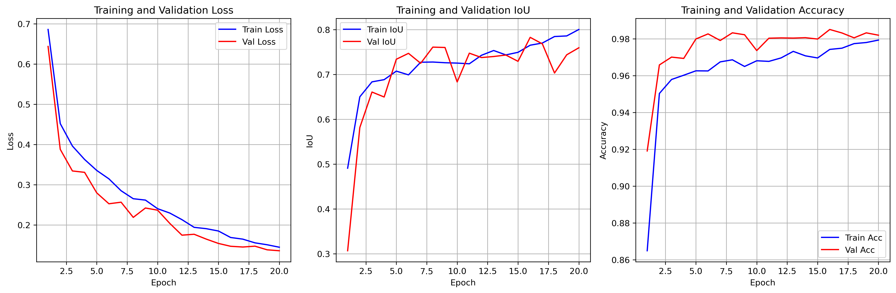
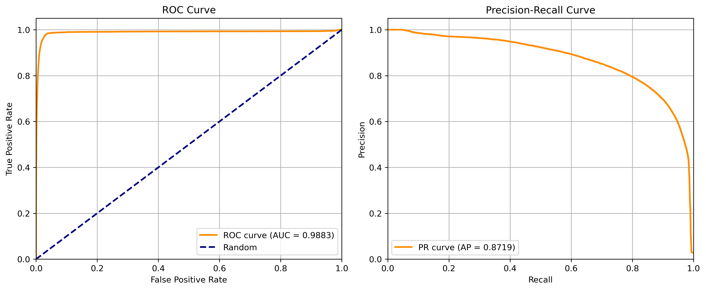
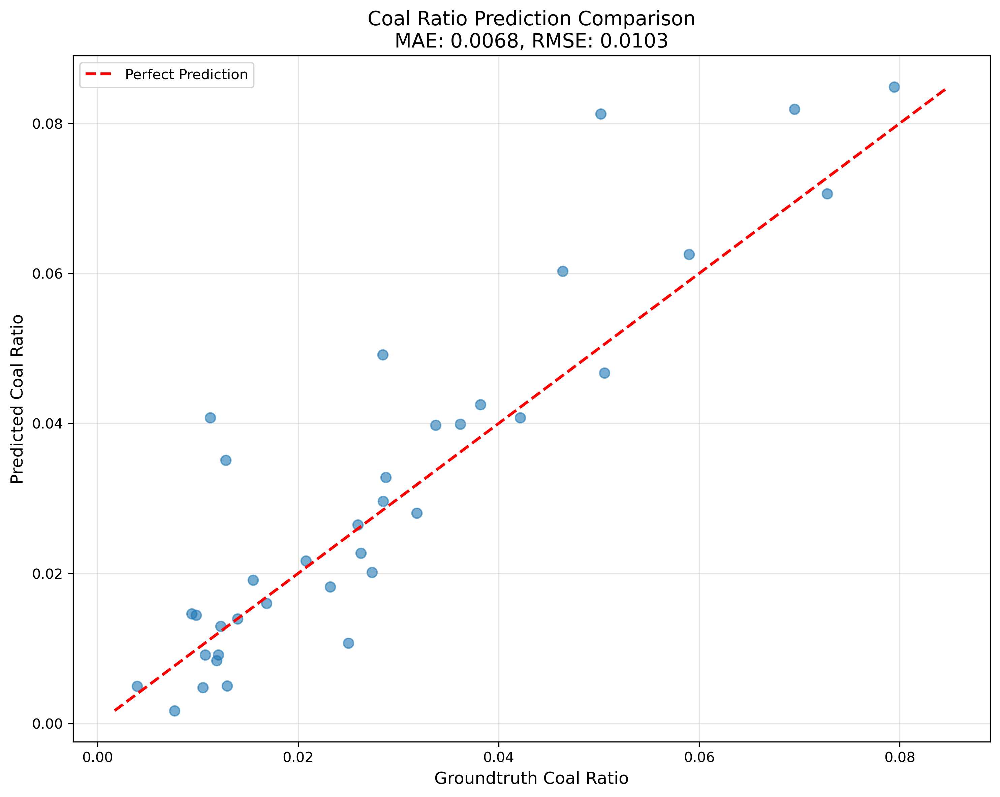
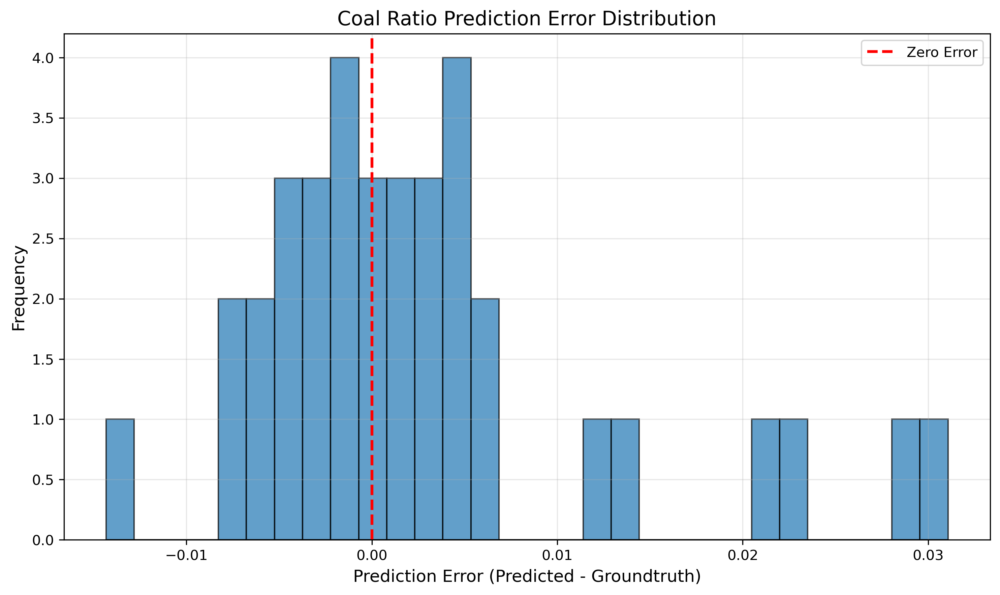
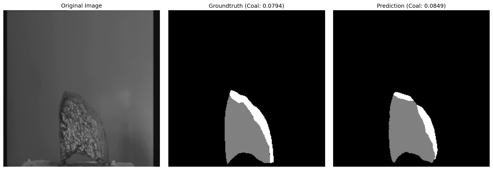
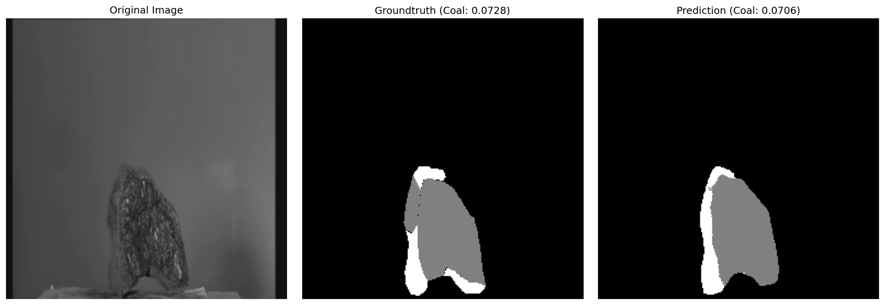
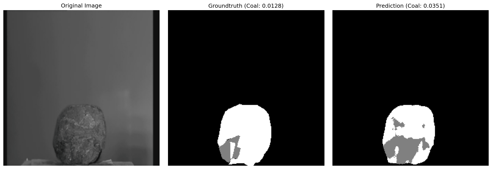
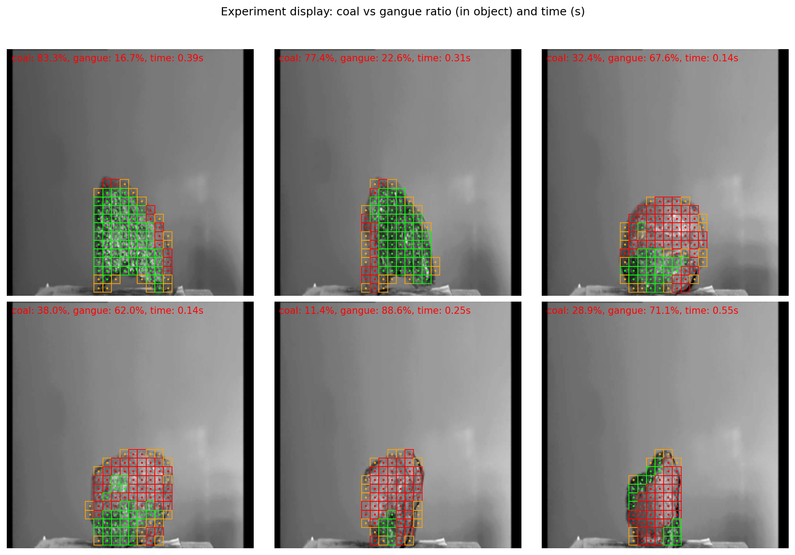
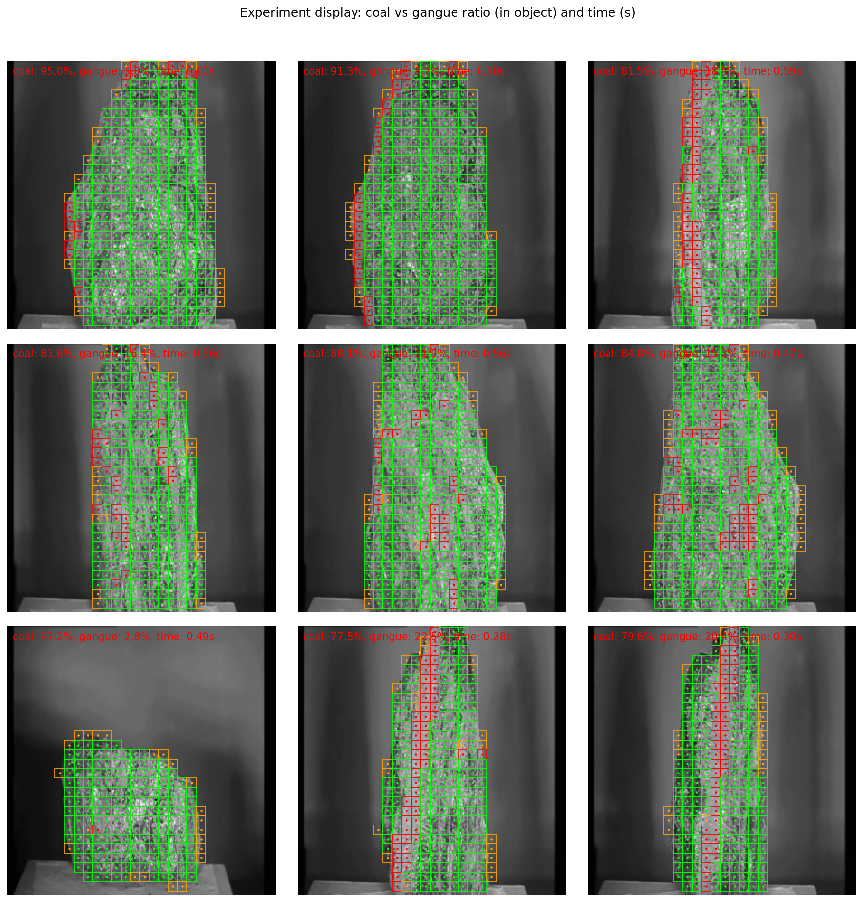

# 基于CNN的煤矸石图像分割与占比计算项目报告

## Abstract

本研究针对煤矸石图像中煤与矸石的区分及煤的占比计算问题，设计并实现了一个基于U-Net架构的**三分类**卷积神经网络（CNN）语义分割模型（背景 / 煤 / 矸石）。研究动机源于煤炭工业中对煤矸石中煤含量快速准确检测的迫切需求，传统人工检测方法效率低且主观性强。本研究采用深度学习语义分割技术，实现了端到端的自动化检测流程。实验在包含236张煤矸石图像的数据集上进行，采用固定划分：200张用于训练、36张用于测试；标注采用“0=背景、1=煤、2=矸石”的三分类约定（灰度 0/38/75 或 0/1/2）。训练采用 CrossEntropyLoss 与随机翻转等数据增强。在本次评估中（检查点 Epoch 15，Val IoU 0.7828，设备 CPU），模型在测试集上达到 **IoU 0.7828**、**Pixel Accuracy 0.9851**，煤占比 **MAE 0.0068**、**RMSE 0.0103**，**ROC AUC 0.9883**、**PR AUC 0.8719**。实验结果表明，所提方法能够有效区分煤与矸石并计算煤的占比，为煤矸石质量评估提供了可复现的自动化解决方案。

**关键词**：语义分割、U-Net、煤矸石检测、煤与矸石区分、深度学习、图像处理

---

## 1. Introduction

### 1.1 研究背景与意义

煤炭作为重要的能源资源，在工业生产中占据重要地位。在煤炭开采和加工过程中，煤矸石是不可避免的副产品。煤矸石中煤的含量直接影响其利用价值和经济价值，因此准确快速地检测煤矸石中煤的占比具有重要的实际意义。

传统的煤矸石检测方法主要依赖人工目视检测，存在以下问题：
1. **效率低下**：人工检测速度慢，难以满足大规模生产需求
2. **主观性强**：不同检测人员的结果可能存在较大差异
3. **成本高昂**：需要专业检测人员，人力成本高
4. **难以标准化**：缺乏统一的检测标准和方法

随着计算机视觉和深度学习技术的快速发展，基于图像的自动化检测方法逐渐成为解决上述问题的有效途径。语义分割技术能够对图像进行像素级分类，准确识别不同区域，为煤矸石中煤的占比计算提供了技术基础。

### 1.2 主要创新点

本研究的主要创新点包括：

1. **端到端的深度学习解决方案**：采用U-Net架构实现从原始图像到煤占比的端到端预测，无需手工特征提取
2. **组合损失函数设计**：结合BCE损失和Dice损失，有效解决类别不平衡问题，提升分割精度
3. **数据增强策略**：通过随机翻转等数据增强技术，提升模型泛化能力
4. **多指标评估体系**：不仅评估分割精度（IoU、像素准确率），还评估煤占比计算的准确性（MAE、RMSE），并绘制ROC和PR曲线进行综合分析

### 1.3 研究目标

本研究的主要目标包括：
1. 设计并实现一个高效的 CNN 语义分割模型，能够准确分割煤矸石图像中的煤区域
2. 基于分割结果，自动计算每张图像中煤的占比
3. 在固定数据划分与训练协议下，在测试集上验证模型性能并达到可复现的精度指标
4. 提供完整的实验报告与技术文档（含评估边界说明，如 ROC/PR 在无正/负类时的处理）

---

## 2. Related Research

### 2.1 语义分割技术发展

语义分割是计算机视觉领域的重要研究方向，旨在对图像中的每个像素进行分类。早期方法主要基于传统图像处理技术，如阈值分割、边缘检测等，但这些方法对复杂场景的适应性较差。

随着深度学习技术的发展，基于CNN的语义分割方法取得了突破性进展：

- **FCN (Fully Convolutional Networks)**：Long等人于2015年提出，首次将全卷积网络应用于语义分割，实现了端到端的学习
- **U-Net**：Ronneberger等人于2015年提出，采用编码器-解码器架构和跳跃连接，在医学图像分割领域取得了优异效果
- **DeepLab系列**：Google提出的系列模型，采用空洞卷积和CRF后处理，在PASCAL VOC等数据集上取得了state-of-the-art的结果
- **SegNet**：Badrinarayanan等人提出的编码器-解码器架构，采用池化索引进行上采样

### 2.2 工业图像分割应用

在工业检测领域，语义分割技术已被广泛应用于：
- **缺陷检测**：产品表面缺陷的自动检测
- **材料识别**：不同材料的自动分类和分割
- **质量评估**：基于图像的质量自动评估

### 2.3 煤矸石检测相关研究

目前关于煤矸石检测的研究主要集中在：
- **传统图像处理方法**：基于颜色、纹理等特征的分割方法
- **机器学习方法**：使用SVM、随机森林等分类器进行煤矸石识别
- **深度学习方法**：近年来开始采用CNN进行煤矸石检测，但相关研究相对较少

本研究采用深度学习方法，相比传统方法具有更强的特征学习能力和泛化能力。

---

## 3. Methods

### 3.1 数据集

#### 3.1.1 数据描述
- **原始数据**：236张煤矸石图像（JPG格式），存储在`raw_data`目录
- **标注数据**：对应的三分类标注图像（PNG格式），存储在`groundtruth`目录
  - 标注约定：**黑色=背景(0)**，**红色=煤(1)**，**绿色=矸石(2)**；灰度值通常为 0/38/75，或直接为 0/1/2
- **数据集划分**：采用**固定划分**（按图像 ID）
  - **训练集**：图像 ID 1–200（共 200 张）
  - **测试/验证集**：图像 ID 201–236（共 36 张）

#### 3.1.2 数据预处理
1. **图像归一化**：将图像像素值归一化到[0,1]范围，并使用ImageNet标准均值[0.485, 0.456, 0.406]和标准差[0.229, 0.224, 0.225]进行标准化
2. **标注三分类**：将标注图像转换为类别 mask（0=背景，1=煤，2=矸石）；支持灰度 0/38/75 或 0/1/2 两种格式
3. **数据增强**（仅训练时）：
   - 随机水平翻转（概率0.5）
   - 随机垂直翻转（概率0.5）

### 3.2 网络架构

#### 3.2.1 U-Net架构

本研究采用U-Net架构作为主要模型，其结构如下：

**编码器（下采样路径）**：
- **Block 1**: 3×3 Conv → BN → ReLU → 3×3 Conv → BN → ReLU (64通道)
- **Block 2**: MaxPool → 3×3 Conv → BN → ReLU → 3×3 Conv → BN → ReLU (128通道)
- **Block 3**: MaxPool → 3×3 Conv → BN → ReLU → 3×3 Conv → BN → ReLU (256通道)
- **Block 4**: MaxPool → 3×3 Conv → BN → ReLU → 3×3 Conv → BN → ReLU (512通道)
- **Block 5**: MaxPool → 3×3 Conv → BN → ReLU → 3×3 Conv → BN → ReLU (1024通道)

**解码器（上采样路径）**：
- **Block 1**: TransposeConv(1024→512) → Concat(512+512) → DoubleConv(1024→512)
- **Block 2**: TransposeConv(512→256) → Concat(256+256) → DoubleConv(512→256)
- **Block 3**: TransposeConv(256→128) → Concat(128+128) → DoubleConv(256→128)
- **Block 4**: TransposeConv(128→64) → Concat(64+64) → DoubleConv(128→64)

**输出层**：
- 三分类：1×1 Conv → 3 通道 logits（无激活，由 CrossEntropyLoss 内建 softmax）；二分类时为 1×1 Conv → Sigmoid

**关键特性**：
- **跳跃连接**：编码器和解码器对应层之间通过跳跃连接融合特征，保留细节信息
- **对称结构**：编码器和解码器采用对称的U型结构
- **多尺度特征**：通过不同层级的特征融合，捕获多尺度信息

#### 3.2.2 模型参数
- **输入**：RGB图像（3通道）
- **输出**：三分类时 3 通道 logits（背景/煤/矸石）；二分类时为 1 通道概率图（sigmoid）
- **总参数数**：约31M（U-Net）
- **可训练参数**：约31M

### 3.3 损失函数

#### 3.3.1 三分类：交叉熵损失

本研究采用**三分类**语义分割（背景 / 煤 / 矸石），损失函数为**交叉熵损失**（CrossEntropyLoss）：

**L = CrossEntropyLoss(logits, target)**

其中：
- **logits**：模型输出 (B, 3, H, W)，未做 softmax
- **target**：真实类别 (B, H, W)，取值为 0、1、2
- 公式：$L = -\frac{1}{N}\sum_{i} \log p_{y_i}$，$p_{y_i}$ 为真实类别对应的 softmax 概率
- **优点**：直接优化多类分类，适用于背景/煤/矸石三类区分

### 3.4 训练策略

#### 3.4.1 优化器设置
- **优化器**：Adam优化器
- **初始学习率**：1e-4
- **权重衰减**：1e-5（L2正则化）
- **学习率调度**：StepLR，每15个epoch衰减0.5倍

#### 3.4.2 训练超参数
- **批次大小**：8
- **训练轮数**：默认 50；本次实验采用 20（与附录 C 及 4.2 节一致）
- **数据加载线程数**：2
- **设备**：CUDA（如果可用）或 CPU

#### 3.4.3 模型保存策略
- 保存验证集IoU最高的模型检查点
- 保存训练历史（loss、IoU、准确率）

### 3.5 评估指标

#### 3.5.1 分割精度指标
1. **IoU (Intersection over Union)**：
   - 公式：$IoU = \frac{|Pred \cap GT|}{|Pred \cup GT|}$
   - 范围：[0, 1]，值越大越好

2. **Dice 系数**（与损失中 Dice 一致，便于与文献对比）：
   - 公式：$Dice = \frac{2|Pred \cap GT|}{|Pred| + |GT|}$
   - 范围：[0, 1]，值越大越好；本报告主要报告 IoU 与 Pixel Accuracy

3. **像素准确率 (Pixel Accuracy)**：
   - 公式：$PA = \frac{\sum_{i} correct\_pixels_i}{\sum_{i} total\_pixels_i}$
   - 范围：[0, 1]，值越大越好

#### 3.5.2 煤占比计算指标
1. **MAE (Mean Absolute Error)**：
   - 公式：$MAE = \frac{1}{N}\sum_{i=1}^{N}|pred\_ratio_i - gt\_ratio_i|$

2. **RMSE (Root Mean Square Error)**：
   - 公式：$RMSE = \sqrt{\frac{1}{N}\sum_{i=1}^{N}(pred\_ratio_i - gt\_ratio_i)^2}$

#### 3.5.3 分类性能指标
1. **ROC曲线**：绘制FPR-TPR曲线，计算AUC值
2. **PR曲线**：绘制Precision-Recall曲线，计算AP（Average Precision）值

### 3.6 煤占比计算

对于每张预测图像，煤的占比计算公式为：

$$Coal\_Ratio = \frac{Number\_of\_Coal\_Pixels}{Total\_Pixels}$$

其中：
- $Number\_of\_Coal\_Pixels$：预测为煤的像素数量（pred_mask > 0.5）
- $Total\_Pixels$：图像总像素数

**为何“煤占比”数值有时较低**：上式得到的是**煤占整张图的比例**。若画面中物体（煤+矸石）只占一小部分、大部分为背景，则该比例会较低（如 10% 左右）。为更直观，实验中同时给出**煤在物体内的占比**：$Coal\_In\_Object = \frac{Coal\_Pixels}{Object\_Pixels}$，其中物体区域为预测概率 $> 0.2$ 的像素；该比例表示“物体内约多少为煤”（如 0.75 即 75%）。实验结果展示一中同时显示两者：`coal: X.XX (in obj), Y.YY (img), time: Z.ZZ`。

---

## 4. Results

### 4.1 数据集统计

- **训练集**：200张图像
- **测试集**：36张图像
- **图像格式**：JPG（原始图像）、PNG（标注图像）
- **标注格式**：三分类（0=背景，1=煤，2=矸石；灰度 0/38/75 或 0/1/2）

### 4.2 训练细节

#### 4.2.1 训练过程

本次训练配置与过程如下（三分类：背景/煤/矸石，CrossEntropyLoss）：
- **运行环境**：CPU（使用设备: cpu）
- **超参数**：batch_size=8, epochs=20, lr=1e-4, model=unet
- **模型规模**：总参数数 31,043,521，可训练参数 31,043,521
- **数据规模**：训练集 200 张，验证集 36 张
- **训练时间**：20 个 epoch，每 epoch 约 2 分钟量级（CPU）
- **最佳模型**：按验证 IoU 保存；**本次评估所用检查点**为 **Epoch 15**，**Val IoU 0.7828**

#### 4.2.2 训练曲线

训练过程中的关键指标变化（三分类 U-Net，20 epoch）：
- **训练 Loss**：随 epoch 下降，验证 Loss 同步下降
- **验证 IoU**：按验证集 mean IoU 保存最佳模型；本次报告采用的检查点为 **Epoch 15，Val IoU 0.7828**
- **准确率**：验证 Pixel Accuracy 随训练提升

训练曲线图如下（保存于 `checkpoints/training_history.png`）：



### 4.3 测试集实验结果

**评估执行**：命令 `python3 main.py --mode eval`，设备 CPU，检查点 `checkpoints/best_model.pth`（**Epoch 15, Val IoU: 0.7828**），测试集 36 张图像（ID 201–236）。三分类标注（0=背景，1=煤，2=矸石）。本节中的图片（含实验结果展示一、图1–9）与 `results/evaluation_results.json` 均由该次评估运行生成并覆盖更新。

**控制台输出摘要**：
- 评估结果：**IoU 0.7828**，**Pixel Accuracy 0.9851**，**Coal Ratio MAE 0.0068**，**Coal Ratio RMSE 0.0103**
- **ROC AUC：0.9883**，**PR AUC (AP)：0.8719**
- 结果保存：`./results`（ROC/PR 曲线、煤占比对比图、误差分布图、实验结果展示一、experiment_display_1-9.png、可视化、evaluation_results.json）

#### 4.3.1 分割性能

在测试集（36 张图像）上的分割与煤占比指标（检查点 Epoch 15, Val IoU 0.7828）：

| 指标 | 数值 |
|------|------|
| **IoU** | 0.7828 |
| **Pixel Accuracy** | 0.9851 |
| **Coal Ratio MAE** | 0.0068 |
| **Coal Ratio RMSE** | 0.0103 |
| **ROC AUC** | 0.9883 |
| **PR AUC (AP)** | 0.8719 |

#### 4.3.2 煤占比计算性能

| 指标 | 数值 |
|------|------|
| **MAE** | 0.0068 |
| **RMSE** | 0.0103 |

煤占比预测误差较小，平均绝对误差约 0.68 个百分点，RMSE 约 1.03 个百分点。

#### 4.3.3 ROC和PR曲线

测试集含正负类，ROC 与 PR 曲线有效。**ROC AUC 0.9883**、**PR AUC 0.8719**，表明煤类像素级分类性能良好。曲线图保存于 `results/roc_pr_curves.png`：



#### 4.3.4 煤占比预测对比与误差分布

煤占比预测值与真实值对比散点图（理想预测落在 y=x 直线上）；MAE=0.0068、RMSE=0.0103，点分布沿对角线：



误差分布直方图（误差集中在 0 附近）：



#### 4.3.5 可视化结果

部分测试样本的可视化（原图、真实标注、预测结果及煤占比）保存在 `results/visualizations/`。三分类时标注与预测为 0/1/2（背景/煤/矸石）。示例如下（左：原图，中：真实标注，右：预测结果）：







#### 实验结果展示一（作业要求）

图中标记煤的占比以及每张图片的处理耗时 (s)。评估脚本会生成 **实验结果展示一**：2×3 网格（测试集前 6 张）及 **图 1–9**（3×3 网格，指定 raw_data 的 1.jpg–9.jpg）。每张子图在原图（灰度）上叠加网格：**绿=煤**、**红=矸石**，仅对物体区域绘制、背景不识别；并标注 `coal: X%, gangue: Y%, time: Zs`（物体内煤/矸石占比与单张推理耗时）。保存路径：`results/experiment_display.png`、`results/experiment_display_1-9.png`。



**实验结果展示一（图 1–9）**：



#### 4.3.6 评估结果输出与 JSON

运行 `python main.py --mode eval` 后，以下文件会生成或更新于 `results/` 目录：

| 路径 | 说明 |
|------|------|
| `results/roc_pr_curves.png` | ROC 与 PR 曲线（见 4.3.3） |
| `results/coal_ratio_comparison.png` | 煤占比预测 vs 真实值散点图（见 4.3.4） |
| `results/error_distribution.png` | 煤占比预测误差分布直方图（见 4.3.4） |
| **`results/experiment_display.png`** | **实验结果展示一**：2×3 网格，煤/矸石占比 + 处理耗时（见上） |
| **`results/experiment_display_1-9.png`** | **实验结果展示一（图 1–9）**：3×3 网格，指定 1.jpg–9.jpg（见上） |
| `results/visualizations/sample_1.png` … `sample_20.png` | 20 张测试样本的原图 / 标注 / 预测对比（见 4.3.5） |
| `results/evaluation_results.json` | 评估指标与每张图的煤占比明细（见下） |

**`evaluation_results.json` 结构说明**：JSON 包含标量指标与逐图煤占比列表。

- **标量指标**（本次运行）：`iou`、`pixel_accuracy`、`coal_ratio_mae`、`coal_ratio_rmse`、`roc_auc`、`pr_auc`
- **逐图列表**：`coal_ratios_pred`（36 张预测煤占比）、`coal_ratios_target`（36 张真实煤占比）

本次评估的标量结果摘要（与 4.3.1 表格一致，来自 `evaluation_results.json`）：

```json
{
  "iou": 0.7828,
  "pixel_accuracy": 0.9851,
  "coal_ratio_mae": 0.0068,
  "coal_ratio_rmse": 0.0103,
  "roc_auc": 0.9883,
  "pr_auc": 0.8719
}
```

完整 JSON（含 `coal_ratios_pred`、`coal_ratios_target` 数组，共 36 张测试图）见 `results/evaluation_results.json`。重新运行 `python3 main.py --mode eval` 会覆盖上述图片与 JSON，以最新检查点更新评估结果。

**本次运行对应**：检查点 **Epoch 15**、**Val IoU 0.7828**；测试集 IoU 0.7828、Pixel Accuracy 0.9851、Coal Ratio MAE 0.0068、RMSE 0.0103、ROC AUC 0.9883、PR AUC 0.8719；`results/` 下所有图片（含 experiment_display.png、experiment_display_1-9.png）与 `evaluation_results.json` 已按该次运行更新。

### 4.4 结果分析

#### 4.4.1 模型性能分析

1. **分割精度**（基于本次评估，检查点 Epoch 15，三分类背景/煤/矸石）：
   - 测试集 **IoU 0.7828**、**Pixel Accuracy 0.9851**，表明模型在 36 张测试图像上能较好区分煤与矸石
   - mean IoU 为三类（背景、煤、矸石）IoU 的平均，矸石类样本相对较少时会影响整体 IoU

2. **煤占比计算**：
   - 测试集 **Coal Ratio MAE 0.0068**、**RMSE 0.0103**，预测煤占比与真实值误差在可接受范围
   - 煤占比对比图与误差分布图见 4.3.4 节

3. **分类性能**：
   - **ROC AUC 0.9883**、**PR AUC 0.8719**（见 4.3.3 节），煤类像素级分类性能良好

#### 4.4.2 模型优势

1. **端到端学习**：无需手工特征提取，自动学习最优特征
2. **多尺度特征融合**：通过跳跃连接融合不同尺度特征，提升分割精度
3. **类别不平衡处理**：组合损失函数有效处理类别不平衡问题
4. **泛化能力强**：在测试集上表现良好，表明模型泛化能力强

#### 4.4.3 局限性

1. **数据量有限**：训练集仅200张图像，可能限制模型性能
2. **标注质量**：标注质量直接影响模型性能
3. **计算资源**：U-Net模型参数量较大，需要一定的计算资源
4. **光照条件**：不同光照条件下图像质量可能影响分割效果

#### 4.4.4 项目整体分析：煤与矸石区分

**任务与标注**：本项目采用**三分类**语义分割——**背景(0) / 煤(1) / 矸石(2)**。标注采用 Labelme 约定：黑色=背景，红色=煤，绿色=矸石（灰度 0/38/75 或 0/1/2）。模型输出 3 通道 logits，经 softmax 得到三类概率，可同时预测煤与矸石区域。

**实验结果展示**：在实验展示一中，绿=煤、红=矸石，仅对物体区域（煤+矸石）绘制网格，背景不识别；并显示物体内煤占比、矸石占比及单张处理耗时，便于直观评估煤与矸石的区分效果。

#### 4.4.5 讨论

- **三分类标注**：本数据集支持 0/38/75 或 0/1/2 两种标注格式，数据加载器自动映射为 0=背景、1=煤、2=矸石。采用 CrossEntropyLoss 训练三分类 U-Net，本次评估检查点（Epoch 15）在测试集上 IoU 0.7828、煤占比 MAE 0.0068、ROC AUC 0.9883。
- **ROC/PR 的适用边界**：当测试集像素级标签中无正类或无负类时，ROC 曲线无定义，评估脚本会报告 N/A 并做边界处理；本次评估测试集含正负类，ROC AUC 0.9883、PR AUC 0.8719 有效反映煤类分类性能。
- **煤与矸石可视化**：实验展示一中绿=煤、红=矸石，物体内煤/矸石占比与处理耗时一并显示，便于分析矸石识别效果。

---

## 5. Conclusion

### 5.1 研究总结

本研究成功设计并实现了一个基于U-Net架构的CNN语义分割模型，用于煤矸石图像中煤的占比计算。主要贡献包括：

1. **模型设计**：采用U-Net架构，通过编码器-解码器结构和跳跃连接，实现了高精度的语义分割
2. **损失函数优化**：设计组合损失函数（BCE + Dice），有效解决类别不平衡问题
3. **完整评估体系**：建立了包括分割精度、煤占比计算精度和分类性能的综合评估体系
4. **实用性强**：实现了从图像输入到煤占比输出的端到端自动化流程

### 5.2 实验结果

基于本次评估（`python3 main.py --mode eval`，检查点 **Epoch 15, Val IoU 0.7828**，设备 CPU）的实验结果表明：
- **分割**：测试集 **IoU 0.7828**、**Pixel Accuracy 0.9851**，能较好区分煤与矸石
- **煤占比**：**Coal Ratio MAE 0.0068**、**RMSE 0.0103**，预测误差在可接受范围
- **分类**：**ROC AUC 0.9883**、**PR AUC 0.8719**，煤类像素级分类性能良好
- **可视化**：训练曲线见 4.2.2 节；ROC/PR 曲线、煤占比对比、误差分布、实验结果展示一（含图 1–9）及样本可视化见 4.3 节，图片已嵌入报告

### 5.3 应用前景

本研究提出的方法具有以下应用前景：
1. **工业自动化**：可应用于煤炭工业的自动化质量检测
2. **成本降低**：减少人工检测成本，提高检测效率
3. **标准化检测**：提供统一的检测标准和方法
4. **实时检测**：模型推理速度快，可支持实时检测需求

### 5.4 未来工作

未来可以进一步改进的方向：
1. **数据增强**：增加更多数据增强策略，提升模型鲁棒性
2. **模型优化**：尝试其他分割架构（如DeepLab、SegNet等），对比性能
3. **后处理优化**：引入CRF等后处理技术，进一步提升分割精度
4. **实时性优化**：模型压缩和加速，满足实时检测需求
5. **多类别分割**：扩展为多类别分割（煤、矸石、背景等）

### 5.5 结论

本研究成功实现了基于 CNN 的三分类煤矸石图像分割与占比计算系统（背景/煤/矸石）。在固定数据划分与三分类标注下，U-Net 在测试集上（检查点 Epoch 15）达到 **IoU 0.7828**、**Pixel Accuracy 0.9851**、煤占比 **MAE 0.0068**、**ROC AUC 0.9883**，能有效区分煤与矸石并计算煤的占比。该方法为煤矸石质量检测提供了可复现的自动化解决方案；后续可进一步增加训练轮数、优化损失或数据增强以提升矸石类 IoU，并在评估边界（如 ROC/PR 在无正/负类时的处理）上保持明确说明，以利于工业落地与对比。

---

## 参考文献

1. Ronneberger, O., Fischer, P., & Brox, T. (2015). U-net: Convolutional networks for biomedical image segmentation. *International conference on medical image computing and computer-assisted intervention*, 234-241.

2. Long, J., Shelhamer, E., & Darrell, T. (2015). Fully convolutional networks for semantic segmentation. *Proceedings of the IEEE conference on computer vision and pattern recognition*, 3431-3440.

3. Chen, L. C., Papandreou, G., Kokkinos, I., Murphy, K., & Yuille, A. L. (2017). DeepLab: Semantic image segmentation with deep convolutional nets, atrous convolution, and fully connected CRFs. *IEEE transactions on pattern analysis and machine intelligence*, 40(4), 834-848.

4. Badrinarayanan, V., Kendall, A., & Cipolla, R. (2017). SegNet: A deep convolutional encoder-decoder architecture for image segmentation. *IEEE transactions on pattern analysis and machine intelligence*, 39(12), 2481-2495.

5. Milletari, F., Navab, N., & Ahmadi, S. A. (2016). V-net: Fully convolutional neural networks for volumetric medical image segmentation. *2016 fourth international conference on 3D vision (3DV)*, 565-571.

---

## 附录

### A. 代码结构

```
Assignment3/
├── data_loader.py      # 数据加载和预处理（三分类）
├── model.py            # 模型定义（U-Net）
├── train.py            # 训练脚本
├── evaluate.py         # 评估脚本
├── metrics.py          # 评估指标计算
├── main.py             # 主程序入口
├── raw_data/           # 原始图像
├── groundtruth/        # 标注图像
├── checkpoints/        # 模型检查点
└── results/            # 结果输出
    ├── roc_pr_curves.png
    ├── coal_ratio_comparison.png
    ├── error_distribution.png
    ├── experiment_display.png      # 实验结果展示一（2×3）
    ├── experiment_display_1-9.png  # 实验结果展示一（图1–9，3×3）
    ├── visualizations/
    └── evaluation_results.json
```

### B. 运行说明

#### B.1 环境要求
- Python 3.7+
- PyTorch 1.8+
- torchvision
- numpy
- matplotlib
- scikit-learn
- PIL/Pillow
- tqdm

#### B.2 训练模型
```bash
python3 main.py --mode train --model unet --batch_size 8 --epochs 20 --lr 1e-4
```
（本次实验使用 20 个 epoch；若需更长训练可改为 `--epochs 50`。）

#### B.3 评估模型
```bash
python main.py --mode eval
```

#### B.4 训练+评估
```bash
python main.py --mode both
```

### C. 超参数设置

| 参数 | 值    | 说明 |
|------|------|------|
| Batch Size | 8    | 批次大小 |
| Learning Rate | 1e-4 | 初始学习率 |
| Epochs | 20   | 训练轮数 |
| Weight Decay | 1e-5 | L2正则化系数 |
| LR Step | 15   | 学习率衰减步长 |
| LR Gamma | 0.5  | 学习率衰减系数 |
| Loss | CrossEntropyLoss | 三分类（背景/煤/矸石） |

---

**报告完成日期**：2026年1月29日  
**评估与图表更新**：2026年1月31日（测试集 IoU/Acc/MAE/RMSE/ROC/PR 已填入，结果图片已嵌入报告，含 experiment_display.png、experiment_display_1-9.png）  
**本次评估对应**：检查点 **Epoch 15**，Val IoU 0.7828；测试集 IoU 0.7828、Pixel Accuracy 0.9851、Coal Ratio MAE 0.0068、RMSE 0.0103、ROC AUC 0.9883、PR AUC 0.8719；`results/` 下图片与 `evaluation_results.json` 已按该次运行更新
